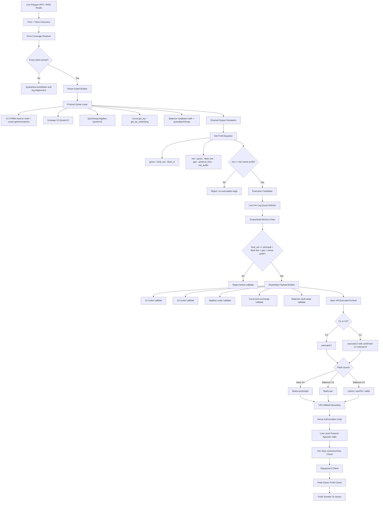

# Apex-Omega End-To-End Execution Pipeline

This is the canonical pipeline from live market discovery through C1/C2 execution.

## C1 / C2 Rules

- C1 and C2 are separate transaction envelopes.
- C2 is only eligible after C1 is confirmed.
- C2 is locked to the C1-derived pair/lane by the off-chain orchestrator.
- C2 expires after five blocks from the C1 block.
- Discovery cycles continue while C2 waits for its decision.
- C2 must choose `MIRROR`, `REVERSE`, or `DO_NOTHING` from post-C1 market state.

## VM Alignment

`ApexOmegaExecutionVM` does not hardcode DEX math. Math belongs off-chain and in fork simulation.
The VM executes any protocol only if the route builder provides:

- `venue`
- `tokenIn`
- `tokenOut`
- `amountIn`
- `minAmountOut`
- `callValue`
- `payload`

The VM then enforces:

- owner-only entrypoints
- emergency stop
- nonce guard
- optional Merkle guard
- authorized router/pool target
- flashloan callback source validation
- per-step minimum output
- final repayment plus owner-profit floor

## Deployment Order

1. Compile `contracts/ApexOmegaExecutionVM.sol`.
2. Deploy with:
   - Aave V3 Pool
   - Balancer V2 Vault
   - Balancer V3 Vault
3. Verify source on-chain.
4. Update both `C1_TARGET` and `C2_TARGET` to the VM address.
5. Authorize known routers as registry type `0`.
6. Authorize route-specific pools such as Curve pools as registry type `1`.
7. Run fork simulation for the first live-profit route.
8. Only submit after fork simulation passes.
